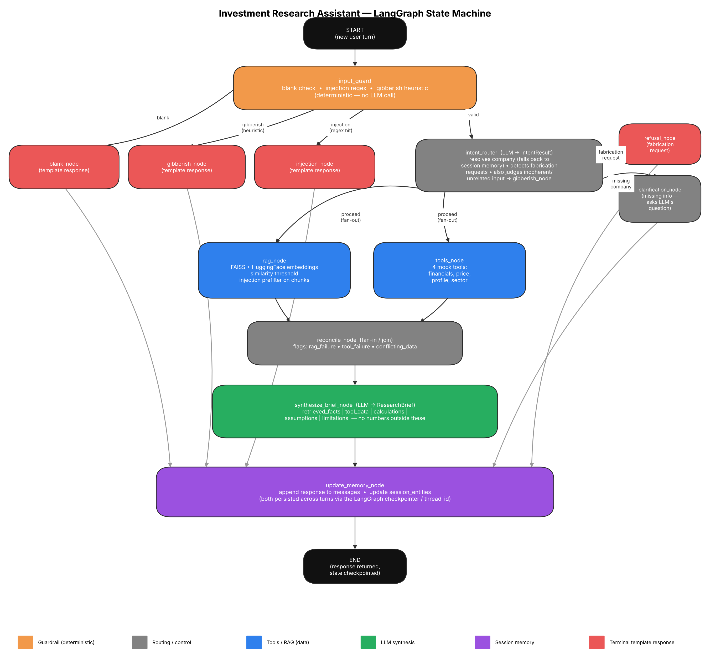
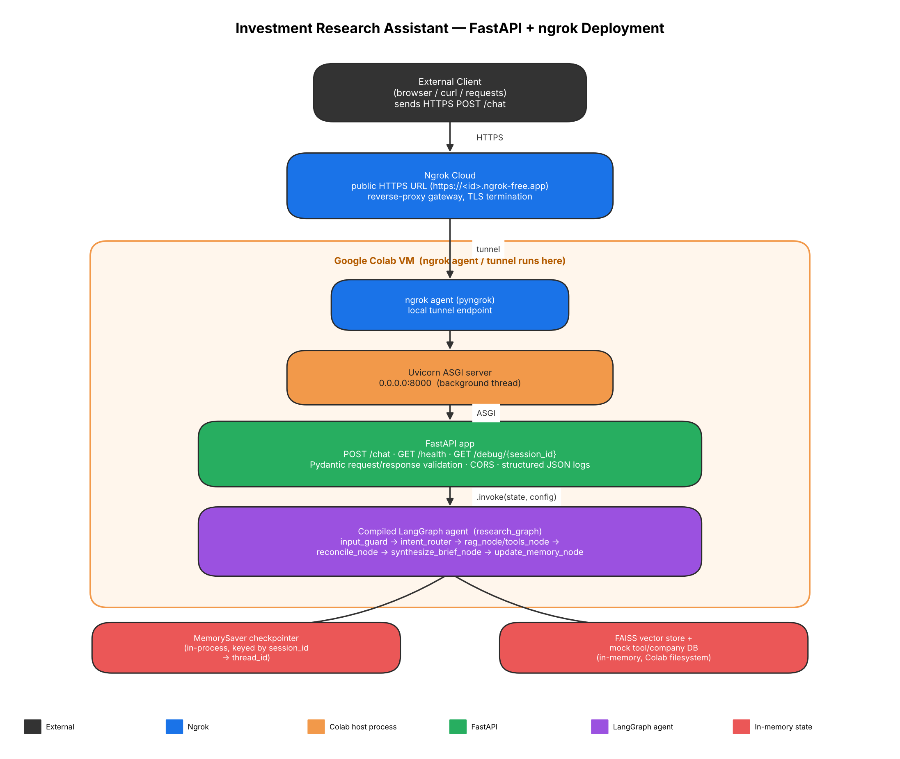

# Investment Research Assistant — Architecture & Design

## 0. Summary

An agentic AI assistant that answers investment-research questions about a
small synthetic universe of companies, grounded in retrieved documents
(RAG) and structured tool calls, with explicit guardrails against
fabrication, prompt injection, blank/gibberish input, and conflicting
numeric data. Implemented in Python, runnable in Google Colab, and
deployable as a public FastAPI service via ngrok.

**Framework choice: LangGraph.** LangChain's higher-level agent
abstractions, CrewAI, and Google ADK were all considered. LangGraph was
chosen because this assignment's requirements — explicit branching on
input validity, a parallel RAG+tools fan-out, a strict "never fabricate"
contract enforced structurally rather than only by prompting, and durable
per-session memory — map directly onto a `StateGraph` of small, auditable,
independently-testable node functions with explicit conditional edges. A
single-LLM-agent-with-tools framework (plain LangChain agents, CrewAI)
would hide this control flow inside the model's own tool-selection
reasoning, which is harder to guarantee and harder to unit-test
deterministically. Google ADK was not used, as it adds Google-specific
scaffolding this assignment does not need.

**RAG: yes**, via a small synthetic in-memory corpus + FAISS, not a live
web-search API (Serper/SearchApi.io were considered and rejected — the
assignment's test cases, including the deliberate RAG-failure and
poisoned-document scenarios, need a fixed, reproducible knowledge base
rather than live, changing search results).

**UI: Gradio**, not Streamlit — chosen for lower-friction Colab embedding
(`demo.launch(share=True)` produces a public URL immediately, no separate
hosting step) and a natural two-column chat-plus-transparency-panel layout.

---

## 1. Architecture diagram



The diagram shows the compiled `StateGraph`: color-coded by node type
(orange = deterministic guardrail, gray = routing/control, blue =
tools/RAG data retrieval, green = LLM synthesis, purple = session memory,
red = terminal template responses, black = graph START/END).

---

## 2. Node-by-node walkthrough

| Node | Type | Responsibility |
|---|---|---|
| `input_guard` | deterministic | Blank check, injection regex, gibberish heuristic. Runs first on *every* turn and is the designated "clean slate" point — see Section 3. |
| `blank_node` / `gibberish_node` / `injection_node` | deterministic template | Terminal responses for the three failure modes `input_guard` can catch outright. |
| `intent_router` | LLM (`IntentResult`) | Resolves the target company (falling back to session memory for pronoun/follow-up references), detects fabrication requests, and makes the *authoritative* semantic judgment on whether input is gibberish/unrelated (see Section 7's two-tier design). |
| `refusal_node` | deterministic template | Fires when `is_fabrication_request` is true — refuses rather than inventing a plausible-sounding number. |
| `clarification_node` | deterministic template | Fires when no company can be resolved — asks the LLM-generated clarifying question rather than guessing. |
| `fan_out` | no-op | Trivial node with two unconditional outgoing edges, used only to fan out to `rag_node` and `tools_node` in parallel using the most basic, version-stable LangGraph primitives (see Section 3). |
| `rag_node` | data | FAISS similarity search (HuggingFace local embeddings), company-filtered in Python, with a similarity threshold below which "no relevant document" is reported rather than returning a weak match. Also applies the injection-detection regex to each retrieved chunk. |
| `tools_node` | data | Deterministic, orchestrated calls to the four mock tools (financials, price, profile, sector) — not left to the LLM's own tool-choice, for auditability. |
| `reconcile_node` | control | The single fan-in point after the parallel `rag_node`/`tools_node` branch. Combines `rag_flags` + `tool_flags` and adds `conflicting_data` flags by comparing numbers mentioned in retrieved text against tool-returned numbers (tolerance-based). |
| `synthesize_brief_node` | LLM (`ResearchBrief`) | Produces the final structured brief: `retrieved_facts` / `tool_data` / `calculations` / `assumptions` / `limitations` / `summary` — the system prompt instructs the model never to state a number outside one of these buckets. |
| `update_memory_node` | memory | Updates `session_entities` (remembered company/focus) and appends the assistant's reply to `messages`, both persisted via the LangGraph checkpointer keyed by `thread_id`/`session_id`. |

---

## 3. State design rationale

- **`messages`** uses the standard `Annotated[List[BaseMessage], add_messages]`
  reducer so chat history appends correctly turn over turn.
- **`rag_flags` / `tool_flags` as separate, disjoint keys** (rather than one
  shared `flags` key with a custom additive reducer): `rag_node` and
  `tools_node` run concurrently in the fan-out, so a shared key would need
  a custom reducer. Worse, because the checkpointer persists state *across
  turns* as well as within one, a naive additive reducer would accumulate
  flags from every past turn forever with no reset mechanism. Giving each
  concurrent node its own output key avoids any custom reducer; a single
  sequential node (`reconcile_node`) is the only writer of the final
  `flags`.
- **`input_guard` as "the clean slate point"**: because state persists
  across turns via the checkpointer, every transient per-turn field
  (`retrieved_docs`, `tool_results`, `flags`, `brief`, `response`, etc.)
  must be explicitly reset at the start of each new turn, or a prior turn's
  values could silently leak into the current one. `input_guard` runs
  first on every path and returns a full reset dict (`TRANSIENT_DEFAULTS`)
  merged with its own classification result, making it the one place this
  reset is guaranteed to happen.
- **Defensive `.get()` on `session_entities`**: on a brand-new thread's
  first turn, LangGraph has not yet materialized any state channel beyond
  what was passed into `.invoke()` — unlike the dependency-free local-dict
  simulation used during development, which always pre-populated every
  key. `intent_router` and `update_memory_node` both read
  `state.get("session_entities", {"company": None, "focus": None})` rather
  than `state["session_entities"]` to avoid a `KeyError` on that first
  turn.
- **Fan-out via a no-op `fan_out` node** with two unconditional
  `add_edge` calls, rather than a conditional-edge function returning a
  list of destination node names. Both are valid LangGraph patterns; this
  implementation deliberately uses only the single-string-return form of
  `add_conditional_edges` (with an explicit path map) everywhere, for
  version stability.

---

## 4. RAG design

- Corpus: five short synthetic documents — two ABC Technologies analyst
  notes (one of which, `sector_note_injection.txt`, is a **deliberately
  poisoned document** containing an embedded prompt-injection string), one
  XYZ Corp analyst note, and one company-less general sector outlook.
  **DEF Industries** has full tool data but *no* corpus document — the
  fixture for the RAG-failure test case.
- Embeddings: `sentence-transformers/all-MiniLM-L6-v2` via
  `HuggingFaceEmbeddings` — free, local, no API key required regardless of
  which paid chat LLM is configured. **This applies to the notebook's own
  interactive graph (Sections 1-9) only.** `investment_research_api.py` —
  the standalone deployed service — uses OpenAI embeddings instead; see
  Section 9c's Render notes and the Troubleshooting entry below for why.
- Retrieval: FAISS `similarity_search_with_score`, company-filtered in
  **Python** (not a specific LangChain/FAISS version's native metadata
  filter argument, which varies across versions) and thresholded
  (`SCORE_THRESHOLD = 0.35`) so that a weak match is treated as "no
  relevant document found" rather than silently returned anyway.
- Every retrieved chunk is run through the same injection-detection regex
  used on user input, so a poisoned document is caught the same way a
  poisoned user message would be.

---

## 5. Tools design

Four mock tools (`get_company_financials`, `get_stock_price`,
`get_company_profile`, `get_sector_data`) living in `tools_mock.py`, each
returning a structured `{"ok": True/False, ...}` result — never raising,
never silently returning a fabricated placeholder. Tool invocation is
**deterministic and orchestrated** by `tools_node`, not left to the LLM's
own tool-selection judgment, so exactly which tools ran (and whether they
succeeded) is always known and testable.

---

## 5b. Real-company market data (Twelve Data)

The synthetic ABC/XYZ/DEF universe exists specifically because the
assignment's required test scenarios (forced tool failure, guaranteed RAG
failure, conflicting data, a poisoned document) need to be deterministic
and reproducible on demand — a live data source can never guarantee that.
Real companies were added **alongside** that universe, not instead of it,
to answer the genuinely useful "what's AAPL's price right now" kind of
question, via the Twelve Data REST API (https://twelvedata.com/stocks),
using a free, no-credit-card `TWELVEDATA_API_KEY`.

- **`real_market_data.py`** curates a small, explicit `REAL_COMPANIES`
  dict (`AAPL`, `MSFT`, `GOOGL`, `AMZN`, `TSLA`, `NVDA`) — kept small and
  closed-set, the same design reasoning as the three synthetic companies,
  rather than open-ended symbol search against Twelve Data's full listing.
  It exposes `get_real_stock_price` / `get_real_company_profile` /
  `get_real_company_financials`, each returning the *exact same*
  `{"ok": True/False, "error":..., "tool":..., "data":...}` contract
  `tools_mock.py` already uses.
- **`tools_node` (in `node_logic.py`) dispatches** between the mock tools
  and the real-company tools based on whether the resolved ticker is in
  `REAL_COMPANIES`:
  ```python
  is_real_company = ticker in REAL_COMPANIES
  financials_fn = get_merged_company_financials if is_real_company else get_company_financials
  profile_fn = get_merged_company_profile if is_real_company else get_company_profile
  price_fn = get_merged_stock_price if is_real_company else get_stock_price
  ```
  The `get_merged_*` functions (`merged_market_data.py`, see Section 5c)
  are what actually call Twelve Data — as of Section 5c they also call
  Alpha Vantage and merge the two, but `tools_node` itself doesn't know or care;
  it's still a two-way dispatch on `is_real_company`, same as when there
  was only one real-data provider. No other node changes shape to support
  this — `reconcile_node`,
  `synthesize_brief_node`, and every guardrail treat a real-company tool
  result identically to a mock one, since the contract is identical.
  `intent_router` resolves a `company_reference` against the **union** of
  both registries (`tools_mock.known_companies()` merged with
  `real_market_data.known_real_companies()`), so "What's Tesla's stock
  price?" and "Compare ABC to Apple" both resolve correctly.
- **Honest free-tier limitation:** Twelve Data's free ("Basic") plan only
  includes the `/quote` endpoint (live price, day change, volume, 52-week
  range) — `get_real_stock_price` works on a free key for every ticker
  above. The `/profile` endpoint (sector, industry, HQ, description)
  requires a paid Grow-tier-or-higher plan, and there is no free
  income-statement/fundamentals endpoint at all. On a free key,
  `get_real_company_profile` and `get_real_company_financials` (which also
  reads `/profile`) both legitimately return
  `{"ok": False, "error": "plan_restricted:..."}`, surfaced as an ordinary
  `tool_failure` flag — consistent with this project's "never fabricate,
  just say so" contract, now holding up against a real API's real plan
  restrictions instead of a simulated failure, rather than being treated
  as a bug to work around. **This specific gap is what Section 5c's second
  provider (Alpha Vantage) closes** — Twelve Data alone still has it; the
  `get_merged_*` functions `tools_node` actually calls do not, as long as
  `ALPHA_VANTAGE_API_KEY` is also set.
- **Real companies will always show `rag_failure`:** the synthetic corpus
  only contains documents about ABC/XYZ/DEF, so any real-company question
  correctly flags no matching document found — this is expected, not an
  error, and is called out in the notebook's live-query demo cell (Section
  10b) rather than silently hidden.
- **Scope limitation — offline mock-LLM mode:** `mock_llm.py`'s
  `_guess_companies()` heuristic (used only when `MOCK_LLM = True`, the
  free/offline demo mode) still reads company names from
  `tools_mock.known_companies()` only, so it will not recognize a real
  company name like "Apple" by name (a bare ticker like "AAPL" still
  routes through `_resolve_any_ticker`, since router-level resolution is
  shared code). Real-company name resolution is fully correct only on the
  production path (`MOCK_LLM = False`, a real LLM via `intent_router`).
  This was a deliberate scope decision, not a bug — extending
  `_guess_companies()` to also check `real_market_data.known_real_companies()`
  would close this gap if the offline demo needs it later.
- Verified with 35 unit tests in `test_real_market_data.py` (mocked
  `requests.get`, since this is a genuinely live third-party API) covering
  ticker/name resolution, a missing API key, a successful `/quote` parse,
  a plan-restricted `/profile` response, a successful `/profile` parse, an
  unknown symbol, and a network timeout — all **35/35 pass** — plus the
  existing 23-check `test_harness.py` suite, confirmed unchanged at
  **23/23** after this integration (the synthetic path makes zero network
  calls, verified explicitly via `mock_get.call_count == 0` for an ABC
  query).

---

## 5c. Closing the data gap: a second provider (Alpha Vantage), merged field by field

Section 5b's honest limitation — Twelve Data's free plan can't serve
company profile at all, and has no fundamentals/income-statement endpoint
on *any* plan tier used here — meant a real-company "financials" question
almost always either failed outright (`plan_restricted`) or "succeeded"
with no actual revenue/margin numbers in it (`get_real_company_financials`
reuses `/profile`'s company-level fields and says so explicitly). Adding a
second, independent live-data provider closes that gap without touching
anything about how Twelve Data itself works.

**Provider history — why this section no longer names FCS API.** The
first version of this integration used FCS API's Stock Market API
(fcsapi.com) as the secondary provider, based on its own published
documentation, which did not flag `/stock/profile` as requiring a paid
plan (unlike `/stock/earnings`, explicitly marked "Stock Corporate+" on
FCS's own pricing page). A live test against a real FCS API free-tier key
during deployment testing showed the opposite: FCS API's free plan
rejects **every** stock endpoint outright — `"A Free API Key user cannot
be used with stock/index endpoint. Please upgrade your plan."` — a
documentation-vs-reality mismatch on FCS API's side, not a bug in this
project's request/response handling (the merge code reported both
providers' real failures honestly; it just had nothing to merge once FCS
API's call failed every time). Alpha Vantage replaced FCS API as the
secondary provider because its free tier has no endpoint-level gating:
every function works on a free key, the only constraint is a request-
count ceiling. `fcs_market_data.py` and `test_fcs_market_data.py` were
deleted rather than kept alongside the new module, since a secondary
provider that cannot be used on a free plan has no reason to stay in the
codebase.

- **`alpha_vantage_market_data.py`** is the Alpha Vantage counterpart to
  `real_market_data.py` — same never-raise `{"ok": ..., "tool": ...,
  "data"/"error": ...}` contract, same request-level response cache
  (`ALPHA_VANTAGE_CACHE_TTL_SECONDS`, default 120s — higher than the other
  two modules' 30s default, because Alpha Vantage's quota is per-**day**,
  not just per-minute, so a cached answer is worth holding onto longer).
  It exposes `get_alpha_vantage_stock_price` (`GLOBAL_QUOTE`) and two
  functions that both read from the **same** `OVERVIEW` call —
  `get_alpha_vantage_company_profile` (sector, industry, address/country as
  `hq`, description, website, market cap — all on Alpha Vantage's **free**
  plan, unlike Twelve Data's equivalent) and
  `get_alpha_vantage_company_financials` (revenue, gross/operating/net
  margin, P/E ratio, EBITDA, and year-over-year revenue growth, all
  derived from the same `OVERVIEW` response's trailing-twelve-month
  fields). Calling `OVERVIEW` once per ticker and sharing it between
  profile and financials via the module-level cache is deliberate: it
  halves the number of requests spent against the tight 25-requests/day
  free ceiling compared to two separate endpoint calls. `net_income_usd_m`
  is the one calculated field here (`RevenueTTM × ProfitMargin` — Alpha
  Vantage's `OVERVIEW` has no direct net-income field), and is labeled as
  calculated in the result's `note` so the transparency panel never
  implies it's a raw reported figure.
- **`merged_market_data.py`** is what `tools_node` actually calls for a
  real company now (`get_merged_stock_price` / `get_merged_company_profile`
  / `get_merged_company_financials`) — it combines the two single-provider
  modules' output, field by field, not provider by provider:
  - **Price**: Twelve Data's `/quote` first; Alpha Vantage's
    `GLOBAL_QUOTE` only as a **fallback** if that call fails. Twelve
    Data's free plan is already reliable for price, so there's no reason
    to spend any of Alpha Vantage's much tighter free-tier quota (25
    requests/day — see `alpha_vantage_market_data.py`'s module docstring)
    on a call that would almost always just duplicate data Twelve Data
    already provided.
  - **Profile and financials**: both providers are called (concurrently,
    via a `ThreadPoolExecutor`), and the two results are merged field by
    field — Twelve Data's value wins wherever it actually has one; any
    field Twelve Data is missing, whether because its call failed
    outright or because it simply never returns that field at all (true
    of every financials field except the profile-derived ones), is filled
    in from Alpha Vantage. A field is never silently dropped and never
    invented — it's either a real number from one of the two providers,
    or genuinely absent from both. (Alpha Vantage's `OVERVIEW` has no
    employee count, CEO name, or founding year fields at all — those
    fields simply don't appear in the merged result anymore, rather than
    being fabricated or carried over from the old FCS-based version.)
  - The merged `data.source` names every provider that actually
    contributed a field this turn (e.g. `"twelvedata.com + alphavantage.co
    (live, merged)"`, or just `"alphavantage.co (live)"` if Twelve Data's
    call failed entirely), and `data.note` lists which specific fields
    were filled in from the secondary provider — the transparency panel
    (both the Gradio and React UIs) renders both of these as-is, so
    provenance stays visible, not just success/failure.
  - `merged_market_data.py`'s merge only reports `ok=False` if **both**
    providers failed completely — the system degrades by losing specific
    fields, never by losing the whole answer when partial real data
    exists.
- **New fields reaching the UI**: `website`, `market_cap_usd_b`,
  `pe_ratio`, `ebitda_usd_m`, and (now genuinely populated)
  `revenue_usd_m` / `net_income_usd_m` / `revenue_growth_yoy_pct` /
  `net_margin_pct` / `gross_margin_pct` / `operating_margin_pct` all flow
  through the existing generic tool-card rendering in both `gradio_app.py`
  and `react-ui/src/components/ToolCard.tsx` with no UI restructuring
  needed — `_format_value`/`_humanize_key` (and their TypeScript ports in
  `react-ui/src/format.ts`) already had the two additions this needed from
  the earlier FCS-based version, kept identical across both: a `_usd_b`
  suffix that auto-scales to `$X.XXT` above $1,000B (`market_cap_usd_b`
  for a company the size of Apple would otherwise print as an unwieldy
  `$3,806.3B`), and a small acronym-fixup table (`pe_ratio` → `P/E Ratio`,
  `hq` → `HQ`) applied after the existing title-casing step.
- **Degrades independently, not as a package deal**: `TWELVEDATA_API_KEY`
  and `ALPHA_VANTAGE_API_KEY` are two unrelated optional environment
  variables (see `RENDER_DEPLOY.md`). Set both for the richest merged
  data; set either alone and `merged_market_data.py` just uses that one
  provider's fields (the other's "call" is a clean, free, instant
  `missing_..._api_key` failure, not a network call); set neither and
  real-company questions get an honest `tool_failure`, exactly as before
  this section existed — the synthetic ABC/XYZ/DEF path never calls either
  provider regardless.
- **Honest limitations, specific to Alpha Vantage**: its free plan's
  25-requests-per-**day** cap (not just per-minute) is tight enough that a
  handful of real-company lookups in a single demo session can exhaust it
  for the rest of the day — this surfaces as an ordinary `rate_limited:...`
  tool failure (Alpha Vantage signals this with a `"Note"` key inside an
  otherwise-200-OK response body, not an HTTP status code — handled
  explicitly in `_alpha_vantage_get`, along with an `"Information"` key for
  a bad/demo API key and an `"Error Message"` key for a bad symbol). The
  response shapes in `alpha_vantage_market_data.py` are taken from Alpha
  Vantage's own published documentation and its GAAP fundamentals field
  reference, not verified against the live API — this sandbox has no
  outbound network access to third-party APIs to test against, the same
  constraint `real_market_data.py` and the earlier FCS-based module were
  built under. Smoke-test both `alpha_vantage_market_data.py`'s and
  `merged_market_data.py`'s `__main__` blocks with a real key in Colab
  before relying on this in front of a grader.
- **A real misclassification bug, caught live and fixed.** The first
  deployed version of `_alpha_vantage_get` classified any `"Information"`-
  body message containing the substring `"api key"` as `invalid_api_key`.
  A live Render deployment test then hit Alpha Vantage's actual
  daily-quota-exceeded message — `"We have detected your API key as
  <KEY> and our standard API rate limit is 25 requests per day..."` —
  which contains that exact substring, so a perfectly valid key that had
  simply used up its free 25-requests/day quota was misreported as
  invalid. Fixed by checking for rate-limit phrases (`"rate limit"`,
  `"requests per day"`, `"requests per minute"`) **before** the
  invalid-key check, since those phrases are specific to the quota
  message and "demo" is specific to the actual invalid-key message. A
  regression test (`test_alpha_vantage_market_data.py`, using the exact
  message text from the live response) now locks this in.
- Verified with 47 unit tests in `test_alpha_vantage_market_data.py`
  (mocked `requests.get` against Alpha Vantage's documented example
  response shapes — success, missing key, rate limiting via the `"Note"`
  body key, the daily-quota-exceeded message via the `"Information"` body
  key (the regression test above), an invalid/demo API key also via
  `"Information"`, a bad symbol returning an empty `{}`, the literal
  string `"None"` standing in for a missing field, a network timeout, the
  response-cache behavior, and the OVERVIEW-shared-between-profile-and-
  financials cache reuse) and 26 unit tests in `test_merged_market_data.py`
  (the merge logic itself, using hand-built provider results rather than
  mocked HTTP — Twelve Data succeeding alone, Alpha Vantage succeeding
  alone, both succeeding with Twelve Data's fields correctly winning and
  Alpha Vantage only filling genuine gaps, and both failing) — **73/73
  pass**, plus `test_real_market_data.py` (35/35) and `test_harness.py`
  (23/23) both confirmed still passing unchanged.

---

## 6. Guardrails and security

| Failure mode | Detection | Where |
|---|---|---|
| Blank input | `is_blank()` | `input_guard` (deterministic, pre-LLM) |
| Prompt injection (user input or retrieved doc) | regex `_INJECTION_RE` | `input_guard` (user input) and `rag_node` (retrieved chunks) |
| Gibberish / nonsensical input | two-tier: fast heuristic + authoritative LLM judgment | `input_guard` (fast path) and `intent_router` (`IntentResult.is_gibberish_or_unrelated`) |
| Fabrication request | keyword/intent detection | `intent_router` (`IntentResult.is_fabrication_request`) → `refusal_node` |
| Missing company/context | no ticker resolved, no session fallback | `intent_router` → `clarification_node` |
| Tool failure | `{"ok": False, ...}` | `tools_node` → flagged in `tool_flags` |
| No relevant document found | below similarity threshold | `rag_node` → flagged in `rag_flags` |
| Conflicting numeric data (doc vs. tool) | number extraction + tolerance comparison | `reconcile_node` |

**Design evolution worth calling out explicitly:** the assignment's
required gibberish test case, `"banana banana 999"`, is lexically valid
(real English words, a plausible vowel ratio), so the pure
character-heuristic `gibberish_score` alone scores it as *not* gibberish
(≈0.40 against a 0.6 threshold) — a genuine limitation of any
heuristic-only approach. This was solved by adding
`is_gibberish_or_unrelated` to the `IntentResult` schema so `intent_router`
makes the authoritative semantic judgment via the LLM, while the
heuristic in `input_guard` remains in place only as a free, fast pre-filter
that catches obvious character-salad input before it would otherwise incur
an LLM call.

**Honest limitation:** prompt-injection defense here is first-layer only —
a regex prefilter plus a system-prompt trust hierarchy in the synthesis
call. It is not a guarantee against every possible injection phrasing, and
a production system would want additional layers (e.g. a dedicated
classifier, output-side verification).

---

## 7. Session memory

`MemorySaver` (LangGraph's in-process checkpointer) persists `messages`
and `session_entities` (remembered company/focus) keyed by `thread_id` (in
the FastAPI deployment, `session_id` is passed through directly as
`thread_id`). This allows follow-up turns like *"Now compare its
profitability with XYZ"* to resolve "its" back to a company named in an
earlier turn. A pronoun+comparison heuristic
(`\bits\b|\bit\b` combined with a `"compare"` cue) ensures a single
company name in such a follow-up is captured as the **comparison target**
rather than overwriting the remembered primary company.

---

## 8. Testing

All business logic was developed and verified in a **dependency-free local
simulation** (`node_logic.py` + `graph_sim.py`, using a heuristic
`MockChatModel` and a keyword-overlap `LocalKeywordRetriever` standing in
for the LLM and vector store), because this development sandbox could not
install `langgraph`/`langchain`/`faiss`/`sentence-transformers` (outbound
package installation was blocked). This produced a 23-check automated test
suite (`test_harness.py`) covering every required scenario — positive,
missing information, fabrication refusal, tool failure, RAG failure,
conflicting data, gibberish (both the heuristic fast-path and the
semantic/LLM-judged case), blank input, injection via user input,
injection via a retrieved document, and two-turn session memory — which
passes **23/23**.

The identical node functions (with the two adaptations noted in Section 3
and the notebook) were then ported into the real LangGraph `StateGraph` in
`Investment_Research_Assistant.ipynb`, which includes an equivalent
test-harness cell run against the real compiled graph (free and offline
with `MOCK_LLM = True`, or against a real provider with `MOCK_LLM =
False`).

---

## 9. Deployment (FastAPI + ngrok)

The notebook's Section 12 wraps the same compiled LangGraph agent
(`research_graph` in the standalone service, `app` inside the notebook
itself) in a FastAPI service and exposes it on a public URL via ngrok,
following the background-thread-Uvicorn-plus-pyngrok-tunnel pattern from
the course's reference deployment notebook.

### Request path



```
External Client → Ngrok Cloud (HTTPS, TLS termination, reverse proxy)
  → Colab VM → ngrok agent (pyngrok) → Uvicorn (0.0.0.0:8000, background thread)
  → FastAPI app → research_graph.invoke(state, config={"thread_id": session_id})
```

### File layout

- **`investment_research_api.py`** — a standalone, importable FastAPI
  service containing the embedded, tested logic from `tools_mock.py`,
  `guardrails.py`, `schemas.py`, `corpus.py`, `mock_llm.py`, and
  `node_logic.py`, plus the FAISS vector store setup, the compiled
  LangGraph graph (named `research_graph` to avoid colliding with the
  `app = FastAPI(...)` instance), and the FastAPI app itself.
- The notebook writes this file to disk from a **base64-encoded** string
  literal (decoded and `ast.parse`-verified before being written) —
  avoiding the string-escaping pitfalls of pasting ~1,500 lines containing
  quotes, f-strings, and triple-quoted docstrings directly into a notebook
  cell.

### Configuration: a `.env` file instead of repeated `getpass()` prompts

The notebook's Section 0 writes a `.env` file to the Colab VM's local disk
(`%%writefile .env`) with placeholder values, which you edit in place with
your real keys before running the load cell that follows it
(`python-dotenv`'s `load_dotenv()`). Any field left as a placeholder (i.e.
still starting with `your_`) falls back to an interactive `getpass()`
prompt for the keys that are actually required — `OPENAI_API_KEY` /
`ANTHROPIC_API_KEY` and `NGROK_AUTH_TOKEN` — while the LangSmith fields
stay genuinely optional.

```
OPENAI_API_KEY=your_openai_key_here
OPENAI_BASE_URL=https://openai.vocareum.com/v1
LANGSMITH_API_KEY=your_langsmith_key_here
LANGSMITH_PROJECT=investment-research-assistant
LANGCHAIN_TRACING_V2=true
NGROK_AUTH_TOKEN=your_ngrok_token_here
```

- **`OPENAI_BASE_URL`** routes every LLM call through a Vocareum
  OpenAI-compatible proxy endpoint instead of `api.openai.com` — needed
  for a course-issued Vocareum key rather than a personal OpenAI account.
  It's pre-filled by default; clear it to call OpenAI directly. Both the
  notebook's own LLM-setup cell and `investment_research_api.py` read this
  (mirrored to `OPENAI_API_BASE` too, since library versions vary in which
  name they check) and pass it through to `init_chat_model(...,
  base_url=...)` whenever the provider is `"openai:..."`.
- **`LANGSMITH_API_KEY` / `LANGSMITH_PROJECT` / `LANGCHAIN_TRACING_V2`**
  enable full LangSmith tracing of every LLM call and graph run when a
  real key is supplied — useful for inspecting exactly what
  `intent_router` / `synthesize_brief_node` produced on a given turn.
  Tracing is explicitly disabled (`LANGCHAIN_TRACING_V2=false`) when the
  key is left as a placeholder, so there's no silent partial
  configuration.
- `.env` lives only on the ephemeral Colab VM's disk (not Google Drive)
  and disappears when the runtime recycles — but treat a filled-in copy of
  this notebook as containing secrets, and don't share or commit it as-is.

### Configuration (environment variables read by `investment_research_api.py`)

| Variable | Default | Purpose |
|---|---|---|
| `MOCK_LLM` | `"false"` | `"true"` uses the offline heuristic `MockChatModel` — no API key needed, for free smoke-testing the deployment wiring itself. |
| `LLM_PROVIDER` | `"openai:gpt-4o-mini"` | Passed to `langchain.chat_models.init_chat_model` when `MOCK_LLM` is false. |
| `OPENAI_BASE_URL` / `OPENAI_API_BASE` | unset | Optional Vocareum (or other OpenAI-compatible) proxy URL — see above. |
| `IRA_SCORE_THRESHOLD` | `"0.35"` | RAG similarity threshold. |
| `IRA_CORPUS_DIR` | `/tmp/investment_research_kb` | Where the synthetic knowledge base is written before indexing. |
| `TWELVEDATA_API_KEY` | unset | Optional. Enables real-company (AAPL/MSFT/GOOGL/AMZN/TSLA/NVDA) market data via Twelve Data — see Section 5b. Unset or missing just makes real-company tool calls fail cleanly (`missing_twelvedata_api_key`); the synthetic ABC/XYZ/DEF universe is unaffected either way. |
| `TWELVEDATA_CACHE_TTL_SECONDS` | `"30"` | How long a Twelve Data response is cached in memory before a repeat call re-hits the network — see Section 9b. Set to `"0"` to disable caching entirely. |
| `ALPHA_VANTAGE_API_KEY` | unset | Optional, independent of `TWELVEDATA_API_KEY`. Fills in company profile and real financial-statement data Twelve Data's free plan can't provide at all — see Section 5c. Unset just means `merged_market_data.py` uses whatever Twelve Data alone returned. |
| `ALPHA_VANTAGE_CACHE_TTL_SECONDS` | `"120"` | Same purpose as `TWELVEDATA_CACHE_TTL_SECONDS`, for Alpha Vantage's response cache — higher default than the other two modules' 30s, since Alpha Vantage's quota is per-day, not just per-minute; see Section 5c. |

### Endpoints

- `GET /health` — status, uptime, and current LLM configuration; used by
  the notebook's own startup polling loop and suitable for an external
  uptime check.
- `POST /chat` — `{"session_id": str, "message": str}` →
  `{"session_id", "response", "latency_ms", "flags"}`. Reusing the same
  `session_id` across calls gets session memory, since it is passed
  straight through as the LangGraph `thread_id`. Note `message` has **no
  `min_length` constraint** — an empty string is valid input that should
  reach the graph's own blank-input guardrail rather than being rejected
  by Pydantic first.
- `GET /debug/{session_id}` — returns the resolved company, flags, tool
  results, and retrieved chunks behind a session's current state — the API
  equivalent of the Gradio UI's transparency panel. **Deliberately left
  unauthenticated**, which is acceptable only because it sits behind a
  private, short-lived ngrok URL for a classroom demo (see Limitations).

### Operational details

- **Structured JSON logging** (`JSONFormatter`, never `print()`) so
  request/response/error events are machine-parseable (Datadog, CloudWatch,
  GCP Logging, etc. all ingest JSON lines directly).
- **CORS** is wide open (`allow_origins=["*"]`) — appropriate for a demo
  reachable only via an ngrok URL you control, not for a production
  deployment serving real users.
- Uvicorn runs in a **background daemon thread** inside the notebook
  process so the cell returns immediately; a health-check polling loop
  (60s timeout) confirms the server is actually serving before the
  notebook proceeds to open the ngrok tunnel.
- `ngrok.kill()` is called before opening a new tunnel, to clear a stale
  tunnel from a previous run and avoid the free tier's `ERR_NGROK_334`
  ("too many simultaneous tunnels") error.
- The free ngrok tier shows a one-time browser interstitial to human
  visitors; the `ngrok-skip-browser-warning: true` header bypasses it for
  API clients (used throughout the notebook's own live-endpoint tests).
- `GET /` redirects to `/docs`, since the bare host/tunnel URL has no
  content of its own — otherwise the first thing a human visitor sees is a
  bare `{"detail":"Not Found"}`.
- **Customizing the ngrok URL:** ngrok's free tier does not allow choosing
  a custom subdomain name — that requires a paid plan. It does give every
  account one free, fixed **dev domain** (e.g.
  `your-assigned-name.ngrok-free.app`) that stays the same across runs,
  instead of a new random URL every time the tunnel reconnects. Claim it
  once at https://dashboard.ngrok.com/domains ("+ Create Domain" — the
  name itself is auto-assigned, not typed in), put it in `.env`'s
  `NGROK_DOMAIN` field, and Section 12.3 passes it to
  `ngrok.connect(8000, "http", domain=NGROK_DOMAIN)` instead of letting
  ngrok assign a random one. Leave that field as its placeholder to keep
  the default random-URL behavior.

### Troubleshooting

- **React Static Site build fails on Render**: `error TS6306: Referenced
  project '.../react-ui/tsconfig.node.json' must have setting "composite":
  true` (from `npm run build`'s `tsc -b && vite build` step). `tsconfig.json`
  references `tsconfig.node.json` (the file that type-checks `vite.config.ts`)
  via TypeScript's project-references feature, which requires the referenced
  project to opt in with `"composite": true` — this is the standard Vite +
  React + TS scaffold's own tsconfig layout, just missing that one flag.
  Fixed by adding `"composite": true` to `react-ui/tsconfig.node.json`'s
  `compilerOptions`. Verified by running the sandbox's pre-installed
  TypeScript (`tsc -b --force`) against the project directly: the `TS6306`
  error disappeared after the fix, leaving only "cannot find module
  'react'/'vite'" errors that are expected here (this sandbox doesn't have
  `react-ui/node_modules` populated with the real `npm install` — those
  packages are correctly listed in `package.json`'s `dependencies`/
  `devDependencies` and resolve fine on Render's actual `npm install`).
- **Chat response reads as a wall of text** (`Research brief — X / Retrieved
  facts: a; b; c / Tool data: ... / Summary: ...` all run together): this is
  simply how `synthesize_brief_node` renders the `ResearchBrief` into a
  single response string — a fixed, parseable shape the test harness and
  the API contract both depend on, so it's deliberately left alone there.
  `gradio_app.py` now reformats that same string into Markdown purely for
  display (`_format_chat_response`): the title line becomes a heading, each
  `Label: item; item` line becomes a bold label plus a bullet list (falling
  back to prose for a single-item section like `Summary`), and anything
  that doesn't match the brief's shape — a guardrail's plain refusal or
  clarification message — passes through completely unchanged. `gr.Chatbot`
  renders Markdown natively, so no change was needed to how messages are
  displayed, only to the string handed to it. One gotcha hit while building
  this: Markdown requires a **blank line** between a header paragraph and
  the list that follows it, or the `- item` lines get swallowed as literal
  hyphens inside the same paragraph instead of rendering as a list — caught
  by rendering the output through `python-markdown` and a headless browser
  screenshot before shipping, not just eyeballing the raw Markdown string.
- **Transparency panel overflowing horizontally / badge text cut off** on a
  real-company tool failure (e.g. TwelveData's `plan_restricted:/profile is
  available exclusively with growth plans and above`): the panel's status
  badges were styled `white-space:nowrap`, fine for short flag strings but
  not for a full-sentence tool error, which forced the badge (and the whole
  right-column panel) wider than its container. Fixed by (1) never putting
  free-text error messages inside a pill badge — the tool-call status badge
  is now always a short fixed label (`ok`/`failed`), with the actual error
  rendered as its own wrapped line below the card instead; (2) switching
  badges from `nowrap` to `normal` + `overflow-wrap:break-word` so even an
  unexpectedly long label wraps instead of overflowing; (3) adding
  `overflow-wrap`/`word-break` to the panel's root container as a second
  safety net. Also tightened while in there: `*_pct` values are now always
  rounded to 2 decimals (a real TwelveData `percent_change` like `0.922395`
  was rendering as `+0.922395%`), and `fifty_two_week_low`/`_high` are now
  `$`-formatted like the rest of the price fields (they don't carry `usd`
  in the key name the way `last_price_usd` does, which the original
  formatting heuristic missed).
- **`gradio.exceptions.Error: "Data incompatible with messages format. Each
  message should be a dictionary with 'role' and 'content' keys..."`** on
  the deployed Gradio UI, thrown from `gradio/components/chatbot.py`'s
  `_check_format` as soon as the first message was sent: `requirements-
  gradio.txt` pinned `gradio>=4.0.0` with no upper bound, so a Render
  rebuild resolved the newest release (6.29.1) instead of whatever 4.x was
  current when `gradio_app.py` was first written. Newer Gradio versions
  require `gr.Chatbot`'s history as a flat list of OpenAI-style
  `{"role": ..., "content": ...}` dicts; `gradio_app.py` was still building
  the older `[[user_message, bot_message], ...]` tuple-pairs format, which
  that `_check_format` call now rejects outright. Fixed by switching
  `_on_submit` to append `{"role": "user", "content": ...}` /
  `{"role": "assistant", "content": ...}` pairs, then pinning
  `requirements-gradio.txt` to the exact version that was actually
  resolved and confirmed working (`gradio==6.29.1`) so a future rebuild
  can't silently jump to a different major release again — the same
  "never use `latest`" rule `Dockerfile.api`/`Dockerfile.gradio` already
  follow for the Python base image. The first attempt at this fix also
  passed `gr.Chatbot(type="messages")` explicitly, which crashed the
  container on startup (`TypeError: Chatbot.__init__() got an unexpected
  keyword argument 'type'`) — in 6.29.1 the `type=` kwarg has been
  removed entirely, since messages-format is now the component's only
  supported format rather than one of two. The constructor call is now
  just `gr.Chatbot(height=450)`, with no `type=` argument at all.
- **`==> Out of memory (used over 512Mi)`** on Render, right after the
  `"Building vector store..."` log line, with the build itself having
  succeeded: this was `HuggingFaceEmbeddings` (`sentence-transformers/all-
  MiniLM-L6-v2`) loading `torch` + `transformers` into the process at
  startup. The build log also showed pip pulling in a full set of NVIDIA
  CUDA packages (`nvidia-cublas`, `nvidia-cudnn`, ~1.5GB combined) that a
  CPU-only Render instance can never use — pure waste, though not itself
  the proven cause of the OOM (unused `.so` files mostly just sit on disk
  rather than loading into RAM). The actual fix was swapping
  `investment_research_api.py`'s embeddings backend from the local
  HuggingFace model to OpenAI's API (`text-embedding-3-small`), which
  removed `langchain-huggingface` / `sentence-transformers` / `torch` from
  `requirements.txt` entirely — a network call instead of a loaded model,
  trading "needs OPENAI_API_KEY + network" for "needs ~0 extra RAM." This
  also meant `MOCK_LLM=True` needed a second look: before this fix, it
  already built the real HuggingFace-backed vector store regardless (only
  the chat LLM was mocked), so it was never truly a "zero API key, zero
  network" offline mode at the `investment_research_api.py` level. It now
  is — `MOCK_LLM=True` skips the embeddings/FAISS branch entirely and uses
  a dependency-free keyword-overlap retriever instead (the same logic
  `test_harness.py`'s local simulation already used), closing that gap
  rather than just working around the immediate crash. The notebook's own
  interactive graph (Sections 1-9) still uses local HuggingFace embeddings
  unchanged — Colab's free tier has enough RAM that this was never an
  issue there; only the standalone deployed service needed to change.
- **`TypeError: Type is not msgpack serializable: numpy.float32`** when
  calling `chat(...)` against the real (non-mock) graph: this was a real
  bug in an earlier version of the `FAISSRetriever.retrieve()` method —
  FAISS's `similarity_search_with_score` returns `distance` as
  `numpy.float32`, and the derived similarity score inherited that numpy
  dtype all the way into `retrieved_docs`, which `MemorySaver`'s
  msgpack-based checkpoint serializer cannot encode. Fixed by casting to a
  plain Python `float` at the point the score is computed
  (`similarity = float(1.0 / (1.0 + distance))`) in both the notebook's
  Section 5 and `investment_research_api.py`. If you're on an older copy
  of either file, re-download the current version.
- **`langsmith.utils.LangSmithError: ... 403 Client Error: Forbidden`**
  repeated on every chat call: this is the optional LangSmith tracing
  integration (Section 0's `.env` fields), and was never fatal — LangChain
  logs the warning and the agent call itself completes normally — but an
  unauthorized key used to cause this to print on *every single* graph
  run, which is its own problem even though nothing is actually broken.
  Section 0 now validates the key with one cheap API call before turning
  tracing on at all: a bad/unauthorized `LANGSMITH_API_KEY` is caught once
  up front (printing a single clear "tracing disabled" message) rather
  than spamming a 403 on every call, and `langsmith.client`'s logger is
  also set to `ERROR` as a second layer in case a transient failure slips
  through after tracing was validated. If you want tracing to actually
  work, fix the key/project at smith.langchain.com; otherwise leave
  `LANGSMITH_API_KEY` as its `.env` placeholder.
- **`[FAIL] rag_failure: flagged`** in the Section 10 test harness, only
  when running against the real FAISS + embeddings retriever (the offline
  `MOCK_LLM = True` / `LocalKeywordRetriever` path always passed this
  check): the original `rag_node` flagged `rag_failure` only when *zero*
  chunks came back at all. Retrieval deliberately lets company-less,
  general-sector documents through regardless of `company_filter` (so a
  general outlook can support any company's question) — and with a real
  semantic embeddings model, that general document can score as
  "relevant" to almost any company query, including DEF Industries
  (which has tool data but, by design, zero documents in the corpus — the
  fixture for this exact test case). So a generic hit was silently masking
  the fact that nothing *specific to DEF* was ever found. Fixed by
  changing the check to "was any chunk's `company` equal to the resolved
  company" rather than "were any chunks returned at all" — a
  company-less chunk can still be included in `retrieved_docs` for
  context, but no longer prevents the `rag_failure` flag on its own.
- **`KeyError: 'brief'`** (or any other `Optional[...]` field) when
  reading `get_state(thread_id).values` after a real graph run, on a path
  that never set that field to anything but its `input_guard`-reset
  `None` (e.g. `brief` on the injection/refusal/clarification paths, which
  never reach `synthesize_brief_node`): unlike the dependency-free local
  simulation (where `new_state()` always pre-populates every key), the
  real compiled LangGraph app does not guarantee a channel whose value is
  still exactly `None` will appear in `get_state().values()` at all — only
  `input_classification`, `flags`, and similar fields that get set to a
  real (non-`None`) value are guaranteed present. Section 10's test
  harness and `investment_research_api.py`'s `/debug` endpoint and Gradio
  transparency panel all read these fields with `.get(key, default)`
  rather than `state[key]` for exactly this reason — if you add your own
  state-inspection code, do the same for any `Optional[...]` field.

### Honest limitations

- The free-tier ngrok URL is **ephemeral** — it changes every time the
  tunnel cell is re-run, and both the tunnel and the server end when the
  Colab runtime disconnects. This is a demo deployment, not a durable one.
- `MemorySaver` is **in-process and in-memory**: session state is lost on
  restart and would not be shared across multiple worker processes — a
  production deployment needing durable or horizontally-scaled session
  memory would need a persisted checkpointer (e.g. backed by Redis/Postgres,
  which LangGraph supports via other checkpointer implementations).
- `/debug/{session_id}` has no authentication.
- CORS is wide open.
- This is a single Colab-hosted process behind a tunnel, not a scaled,
  production-grade deployment — appropriate for this assignment's demo
  requirements, not as-is for serving real users.

---

## 9b. Performance and token-usage optimizations

A later pass over the whole solution, specifically targeting runtime
latency, external-API efficiency, LLM token usage, and FastAPI service
overhead — each verified against the existing test suites rather than
assumed safe.

**External API efficiency (`real_market_data.py`).** `tools_node` was
issuing three sequential Twelve Data calls per real-company turn, but two
of them — `get_company_profile` and `get_company_financials` — hit the
exact same `/profile` endpoint for the same ticker (Twelve Data has no
separate free fundamentals endpoint; `get_company_financials` reads
`/profile` too — see Section 5b). That duplicate call is now eliminated by
a short-TTL (`TWELVEDATA_CACHE_TTL_SECONDS`, default 30s) in-memory cache
inside `_twelvedata_get`, keyed by `(endpoint_path, ticker)`: whichever
call runs first populates the cache, and the second is served from memory
with its `"tool"` field relabeled to match the caller. Only deterministic
outcomes are cached — a successful response and a deterministic API error
like `plan_restricted` or "symbol not found" — never a transient network
error, so a momentary blip isn't "remembered" as a sustained outage for
the rest of the TTL window. A repeated question about the same ticker
within that window (e.g. "what's AAPL's price?" asked twice) is also now a
cache hit rather than a fresh call, which matters on Twelve Data's free
tier's limited per-minute request quota. A module-level `requests.Session()`
(`_SESSION`) replaces ad hoc `requests.get()` calls, reusing one HTTP
connection (keep-alive) across every call instead of a new TCP/TLS
handshake each time. Verified with 8 new checks in
`test_real_market_data.py` (now 35/35) that explicitly assert the mocked
network call count — e.g. `get_company_profile` + `get_company_financials`
for the same ticker make exactly **one** mocked network call, not two;
`clear_cache()` forces a fresh call; a mocked timeout is never cached.

**Latency (`node_logic.py`'s `tools_node`).** For a real company, `/quote`
(price) and `/profile` (profile) are independent Twelve Data endpoints
with no data dependency between them, so they're now fetched concurrently
via a small `concurrent.futures.ThreadPoolExecutor(max_workers=2)` instead
of waiting for one blocking network call before starting the other.
`get_company_financials` is called only after that pool resolves — not
submitted into it alongside `get_company_profile` — so it deterministically
lands on the cache entry profile just populated instead of racing it (two
truly-concurrent calls would both miss an empty cache and both hit the
network, defeating the dedup above). Net effect for a real-company turn:
two real network calls instead of three, and the two that remain run in
parallel rather than in series. Verified end-to-end (not just at the
`real_market_data.py` unit level) with a direct call to `tools_node` under
mocked HTTP, asserting exactly 2 network calls and a correctly-relabeled
`get_company_financials` result. The synthetic ABC/XYZ/DEF branch is
untouched — those are in-memory dict lookups with no I/O to parallelize,
and leaving that code path exactly as it was keeps the existing 23-check
`test_harness.py` suite (which only exercises synthetic companies) a
no-risk change rather than something that needed re-verifying.

**LLM token usage (`synthesize_brief_node`).** `_render_tool_line` used to
interpolate `result["data"]`'s raw Python dict repr into the prompt sent
to the chat LLM. That repr included two kinds of pure token cost with zero
decision-relevant information: a `"source"` field whose value is always
the same static string, repeated once per tool result every single turn,
and `None`-valued fields (common on a real company's profile, where
Twelve Data doesn't return every field). It now renders compact
`key=value` pairs with both dropped, while keeping every field the LLM
actually needs — including Twelve Data's free-tier "note" on
`get_company_financials`, since the brief's "limitations" bucket depends
on the model seeing it. `mock_llm.py`'s `_mock_brief` only does
header-based line-splitting (it never parses specific field names out of
`TOOL_RESULTS:`), so this formatting change doesn't touch the 23-check
suite's assertions — confirmed by re-running `test_harness.py` (still
23/23) after the change.

**FastAPI service efficiency.** Added `GZipMiddleware` (500-byte floor) to
`investment_research_api.py`'s app, alongside the existing CORS middleware
— compresses `/chat` and especially `/debug/{session_id}` responses
(which can include several retrieved-document chunks plus full tool
results) before they cross the ngrok tunnel. `/health` and other tiny
responses are left uncompressed by the size floor, since compression
overhead there would cost more than it saves.

**Considered and intentionally left alone:**
- *FAISS/embeddings as singletons*: already built once at module import
  time (`_embeddings`, `_vectorstore`, `retriever` in Section 5 /
  `build_api_app.py`), not per-request — there was nothing to fix here;
  this was confirmed, not changed.
- *Caching LLM responses themselves* (not just tool/API calls): considered
  and rejected. A cached answer to "what's AAPL's price" would go stale
  the moment the real price moves, which directly conflicts with this
  project's foundational "never present fabricated or stale data as
  current fact" guardrail philosophy (Section 6) — the token savings
  weren't worth reintroducing that risk.
- *Making `/chat` an `async def` endpoint*: FastAPI already runs a
  sync `def` route in a worker thread pool automatically, so concurrent
  requests don't block the event loop as-is; converting to `async def`
  would need an async LLM client and an async Twelve Data client to
  actually gain anything, which is more surface area than this demo-scale
  deployment needs.

---

## 9c. Deployment 2: Render.com (alongside ngrok)

Section 9's ngrok tunnel and this Render deployment serve two different
needs with the exact same application code — nothing about
`investment_research_api.py` changes between them, only the envelope
around it:

| | ngrok (Section 9) | Render.com |
|---|---|---|
| URL | Random, changes every restart (or a claimed dev domain) | Permanent, same URL across restarts |
| Lifetime | Dies when the Colab runtime disconnects | Persists; auto-restarts on crash |
| Best for | A time-boxed demo, iterating in Colab | A URL a grader/teammate can hit any time, without you keeping a notebook running |

**Config is environment-only, same rule as everywhere else in this
project**: `investment_research_api.py` now also calls `load_dotenv()` at
startup (it's a no-op if no `.env` file exists), so locally or in
Vocareum you can copy `.env.example` to `.env` and fill in real values
instead of exporting shell variables by hand — `load_dotenv()` only fills
in a key that ISN'T already set, so it never overrides whatever a real
host (Render, Docker, Cloud Run) injects directly, and nothing is ever
hardcoded in the app, in `render.yaml`, or anywhere else in the repo.
`.env` itself is excluded via `.gitignore` and must never be committed.

**Deployment bundle** (five files, all at the repo root, all pushed to
GitHub — see `RENDER_DEPLOY.md` for the exact commands and Render
dashboard steps):

- `investment_research_api.py` — the service itself. Its RAG embeddings
  backend is OpenAI's API (`text-embedding-3-small`), not the local
  HuggingFace model the notebook's own interactive graph uses — see the
  Troubleshooting entry below for why this file specifically diverges.
- `requirements.txt` — every package the service actually imports
  (FastAPI/Uvicorn, LangGraph/LangChain + both `langchain-openai` and
  `langchain-anthropic` since `LLM_PROVIDER` supports either, FAISS,
  `python-dotenv`, `requests`), each pinned to a minimum version. Notably
  absent: `langchain-huggingface` / `sentence-transformers` / `torch` —
  see below.
- `render.yaml` — build command (`pip install -r requirements.txt`),
  start command (`uvicorn investment_research_api:app --host 0.0.0.0
  --port 10000`), `healthCheckPath: /health`, and the full set of
  environment variables the app reads. Non-secret config (`MOCK_LLM`,
  `LLM_PROVIDER`, `IRA_SCORE_THRESHOLD`, `TWELVEDATA_CACHE_TTL_SECONDS`,
  `ALPHA_VANTAGE_CACHE_TTL_SECONDS`) is inlined directly in the file since
  there's nothing sensitive about it; every actual secret
  (`OPENAI_API_KEY`, `ANTHROPIC_API_KEY`, `OPENAI_BASE_URL`,
  `TWELVEDATA_API_KEY`, `ALPHA_VANTAGE_API_KEY`) is declared with
  `sync: false`, which makes Render prompt for the value in its dashboard
  rather than storing it in this version-controlled file.
- `.env.example` — a template (placeholder values only) documenting every
  config key the app reads, for local/Vocareum testing.
- `.gitignore` — excludes `.env`, `__pycache__/`, and other local-only
  files, so a real `.env` can never be pushed by accident.

**Honest limitations specific to Render, beyond what Section 9 already
covers for ngrok:**
- **Free-tier cold starts**: the service spins down after 15 minutes of
  inactivity; the first request after that takes 30-60s. Send a warm-up
  request before a demo.
- **`OPENAI_API_KEY` is now required even with an Anthropic chat model**:
  since RAG embeddings always call OpenAI's API (see the Troubleshooting
  entry below), `LLM_PROVIDER=anthropic:...` still needs `OPENAI_API_KEY`
  set — `ANTHROPIC_API_KEY` is additive, for the chat calls only.
- **`MemorySaver` is still in-process** (Section 9's limitation holds
  here too, and is the sharper edge on Render specifically): any
  restart — a redeploy, a crash recovery, or a free-tier spin-down — loses
  every session's history. A production deployment needing durable
  memory across restarts would swap in a persisted LangGraph checkpointer
  (Redis/Postgres), same as noted in Section 9.
- **`/debug/{session_id}` is still unauthenticated** — fine for a demo URL
  only you and a grader know, not for a public production service.

---

## 9d. Gradio frontend, deployed standalone (on top of Render)

Section 11 (in the notebook) already has an optional Gradio chat UI, but
that one calls `chat()`/`get_state()` **in-process** — it only exists
while the Colab notebook's kernel is running the compiled LangGraph
`app` directly. It can't put a UI in front of the *deployed* Render
service, because it never leaves the notebook process.

`gradio_app.py` is a second, independent piece: the same two-column chat
+ transparency-panel layout, but talking to the deployed API purely over
HTTP (`POST /chat`, `GET /debug/{session_id}`) via `requests`. It has no
LangGraph/LangChain/FAISS dependency at all and needs no LLM or data
provider keys — it only needs to know where the API lives.

**Config is environment-only, same rule as the rest of this project**:
`API_BASE_URL` (the only required variable) is read from the
environment, with `load_dotenv()` as a local/Vocareum convenience, same
pattern as `investment_research_api.py`. Nothing is hardcoded in
`gradio_app.py` or in `render.yaml`'s second service block.

**The transparency panel is formatted, not raw JSON.** Flags render as
colored status badges (critical/serious/warning/good, each paired with an
icon so the signal never relies on color alone — e.g. an `injection*`
flag is critical/red, `tool_failure:*` is serious/orange, `rag_failure`
and `conflicting_data:*` are warning/amber, no flags is a green "No
issues flagged"). Each tool call renders as its own card: an ok/failed
badge plus its data fields formatted by a generic heuristic keyed off the
field name itself (`*_pct` → signed percent, `*_usd` → `$`-formatted,
`employees` → comma-grouped integer) — this works unchanged for both the
synthetic ABC/XYZ/DEF tools and the real TwelveData-backed tools, since
both already share the `*_pct`/`*_usd` naming convention (see Section
2's tool contract). Any `*_pct` fields returned this turn are also
charted as a horizontal bar chart (blue for positive, red for negative —
the data-viz palette's documented diverging pair, which fits naturally
since these are gain/loss values straddling zero); the chart clears
itself when a turn has no numeric fields to show, e.g. a RAG/tool-failure
case. The exact JSON payload is still available, just collapsed under a
"Raw debug JSON" accordion rather than being the only view — useful for
grading/debugging without cluttering the default read.

**Deployed as its own Render Web Service**, separate from the API, so
its build stays small (`gradio`, `requests`, `python-dotenv`,
`matplotlib` for the chart — see `requirements-gradio.txt`) and a
problem in one service can't take the other down. See `GRADIO_DEPLOY.md`
for the exact steps; in short:

| Field | Value |
|---|---|
| Build Command | `pip install -r requirements-gradio.txt` |
| Start Command | `python gradio_app.py` |
| Health Check Path | `/` |
| Env var | `API_BASE_URL=https://investmentresearch.onrender.com` |

`gradio_app.py` binds to `0.0.0.0` and to Render's injected `PORT` (not
Gradio's default `localhost:7860`), since Render routes external traffic
to whatever port the app actually listens on.

**Honest limitations**: running two free-tier services means two
possible cold starts stacked on top of each other (the UI wakes up, then
its first request wakes up the API) — `API_TIMEOUT_SECONDS` defaults to
60s to absorb this, and the UI shows a clear in-chat error rather than
crashing if a request still times out. Like `/debug/{session_id}` on the
API, this UI has no authentication of its own.

---

## 9e. Deployment 3: Docker (+ optional Cloud Run)

Following the Week 16 notebook's Section 7, the same two services from
9c/9d — `investment_research_api.py` and `gradio_app.py` — are also
packaged as Docker images. Same application code in all three
deployments (ngrok, Render, Docker); only the envelope changes, exactly
the notebook's core point about Docker.

**Two images, one Compose stack.** `Dockerfile.api` and
`Dockerfile.gradio` each follow the notebook's recipe: pin the exact
Python version (`python:3.11-slim`), copy `requirements*.txt` before
application code so the pip-install layer caches across rebuilds, copy
only the single self-contained app file (neither `investment_research_api.py`
nor `gradio_app.py` imports any sibling module — see 9c and 9d), bind
`uvicorn`/Gradio to `0.0.0.0` so the port is reachable from outside the
container. `docker-compose.yml` runs both together, with Gradio reaching
the API by Compose service name (`http://api:8000`) rather than a public
URL — a fully offline local stack, no ngrok or Render dependency to
develop or demo.

**Config is environment-only, same rule as 9c/9d**: secrets are injected
at container *runtime* via `--env-file`/Compose's `env_file`, never
baked into either image. `.dockerignore` excludes `.env` for the same
reason the notebook calls out — a leaked key in a pushed image has cost
companies millions — and also excludes every other file in the repo that
neither app file actually imports (notebook-build scripts, tests,
diagrams), keeping the build context small.

See `DOCKER_DEPLOY.md` for exact commands: `docker compose up --build`
for the quick path, or the notebook-equivalent manual `docker build`/
`docker run` commands, plus optional Google Cloud Run deployment
commands for both images (Cloud Run's own injected `PORT`, usually 8080,
needs to override the Dockerfiles' hardcoded 8000/7860 if used).

**Honest limitations**: this sandbox's own network policy blocks
`registry-1.docker.io`, so the Dockerfiles and `docker-compose.yml` were
validated for syntax/structure (`docker compose config`, Dockerfile
parse) but not built and run end-to-end here — that step needs to happen
on your own machine or Vocareum's terminal, same as the notebook's
Section 7 post-class lab already assumes. Otherwise, the same limitations
as 9c apply: `MemorySaver` is still in-process (a container restart
loses session history), and neither `/debug/{session_id}` nor the Gradio
UI has authentication.

---

## 9f. React frontend, deployed as a Render Static Site (alongside Gradio)

A fourth frontend for the same deployed API, built after feedback that
the Gradio UI's default theme "feels like text boxes on a page." This is
not a replacement for `gradio_app.py` — both stay deployed and both
remain fully independent; they're two different UI treatments of the
exact same `/chat`/`/debug/{session_id}` HTTP contract.

**Where it lives**: `react-ui/` — a standalone Vite + React + TypeScript
project. Like `gradio_app.py`, it is a *pure client* of the already-deployed
API: no LangGraph/LangChain/FAISS, no LLM or data-provider keys, nothing
server-side at all. That's what makes it deployable as a Render **Static
Site** rather than a Web Service — the build output (`dist/`) is plain
HTML/CSS/JS served directly, with no process of its own to sleep, crash,
or need a health check.

**Same logic as the Gradio panel, ported rather than re-derived.**
`src/format.ts` and `src/palette.ts` are direct TypeScript ports of
`gradio_app.py`'s `_flag_status`/`_humanize_flag`/`_humanize_key`/
`_humanize_tool`/`_format_value` and its `_STATUS_STYLE`/color constants
— same severity mapping (`injection*` → critical, `tool_failure*` →
serious, `rag_failure`/`conflicting_data*` → warning), same number
formatting (2-decimal signed percentages, `$`-formatted USD and
`*_low`/`*_high` fields, comma-grouped whole-number fields), same hex
values for every status color and the diverging blue/red pair. A research
brief's "Research brief — X" / "Label: item; item" shape is parsed by
`parseBrief()` (`src/format.ts`) into structured sections and rendered as
real JSX headings and `<ul>` lists in `ChatMessage.tsx`, rather than
generating a Markdown string the way the Gradio layer does — same
display-only reformatting, different rendering path, same rule: this
never touches the API's actual response string, only how this one client
displays it.

**Layout**: a gradient header, then a two-column grid — chat on the left
(`ChatPanel.tsx`/`ChatMessage.tsx`, message bubbles rather than a
Gradio-style log), transparency panel on the right
(`TransparencyPanel.tsx`/`Badge.tsx`/`ToolCard.tsx`/`MetricsChart.tsx`):
colored flag badges, one card per tool call (an always-short "ok"/"failed"
badge, with the actual error text — which can be a full sentence, e.g.
TwelveData's `plan_restricted:...` message — wrapped on its own line
below, never inside the pill, carrying forward the exact fix applied to
the Gradio panel after the same overflow bug showed up there), an SVG bar
chart of any `*_pct` fields (blue/red diverging pair, same axis-padding
math as the Gradio version's matplotlib chart so a single-bar turn's
value label never clips), and a collapsed "Raw debug JSON" section.
Collapses to a single column under ~860px.

**Session handling**: `sessionId` is a `crypto.randomUUID()` stored in
`sessionStorage` (not `localStorage`) — a page refresh keeps the same
LangGraph checkpointer thread, but a new tab or the "New session" button
always starts fresh, so concurrent visitors to the same deployed URL
don't accidentally share one session.

**Config is build-time, not environment-only** — the one genuine
difference from every other deployment in this project. A static site has
no running process to read an environment variable at request time, so
`VITE_API_BASE_URL` (read in `src/api.ts` via `import.meta.env`) is baked
into the JavaScript bundle by Vite at `npm run build` time. Render's
Static Site "Environment Variables" are build-time inputs for exactly
this reason — see `RENDER_REACT_DEPLOY.md` for the full explanation and
exact Render dashboard fields (Root Directory `react-ui`, Build Command
`npm install && npm run build`, Publish Directory `dist`).

**Honest limitations**: this sandbox's npm registry access is blocked
(same class of restriction documented in 9e for Docker Hub), so
`npm install`/`npm run build` have not run end-to-end here. Verification
instead rendered every component (`Badge`, `ToolCard`, `TransparencyPanel`,
`MetricsChart`, `ChatMessage`) to static HTML with `react-dom/server`
against the same MSFT/TwelveData-error sample payload used to verify the
Gradio panel, asserted the same formatting invariants (clean integer
volume, 2-decimal percentages, `$`-formatted 52-week low/high, full
untruncated error text, no overflow), and screenshotted the result with
Playwright at both desktop and mobile widths. `RENDER_REACT_DEPLOY.md`
asks you to run `npm install && npm run build` locally before the first
Render deploy, for the same reason 9e asks you to `docker compose up
--build` locally first. Otherwise, the same limitations as 9d apply: no
authentication, and a cold-started API can still take 30-60s to answer
the first request after this page itself has already loaded instantly.

---

## 10. Running instructions

1. Open `Investment_Research_Assistant.ipynb` in Google Colab.
2. Run Section 0's cells in order: install dependencies, run the
   `%%writefile .env` cell once, **edit that cell with your real keys**
   (OpenAI/Vocareum key, optionally a LangSmith key, your ngrok auth token,
   and optionally a free `TWELVEDATA_API_KEY` for real-company data — see
   Section 5b) and re-run it, then run the `load_dotenv()` cell — any
   placeholder left in `.env` falls back to a `getpass()` prompt for the
   keys that are required (`TWELVEDATA_API_KEY` is optional and has no
   `getpass()` fallback; leave it as its placeholder to skip real-company
   data entirely).
3. Run Sections 1–9 to build the agent (tools, guardrails, schemas, corpus,
   vector store, LLM, graph) — this includes Section 1b, which loads the
   real-company tools from `real_market_data.py`.
4. Run Section 10 to execute the full automated test suite against the
   real compiled graph. Section 10b is an optional, ungraded demo cell
   that asks a live real-company question (e.g. "What's Tesla's current
   stock price?") when `TWELVEDATA_API_KEY` is set and `MOCK_LLM = False`;
   it self-skips otherwise.
5. Optionally run Section 11 (`demo.launch(share=True)`) for an in-notebook
   Gradio chat UI.
6. Run Section 12 to deploy the agent as a public FastAPI service via
   ngrok, and exercise the live HTTP endpoint with the provided test calls.

---

## 11. Rubric mapping (test-case coverage)

| Required scenario | Covered by |
|---|---|
| Positive case | `test_harness.py` check 1 / notebook test `t1` / API demo 1 |
| Missing information → clarify | check 2 / `t2` |
| Fabrication request → refuse | check 3 / `t3` |
| Tool failure → flagged, not fabricated | check 4 / `t4` |
| RAG failure (no matching document) → flagged | check 5 / `t5` |
| Conflicting data (doc vs. tool) → flagged | check 6 / unit test on `reconcile_node` |
| Gibberish/unrelated input | checks 7a/7b / `t7`, `t7b` / API demo 2 |
| Blank input | check 8 / `t8` |
| Prompt injection via user input | check 9 / `t9` / API demo 3 |
| Prompt injection via retrieved document | check 10 / `t10` |
| Session memory across turns | check 11 / `t11` / API demo 4 |
